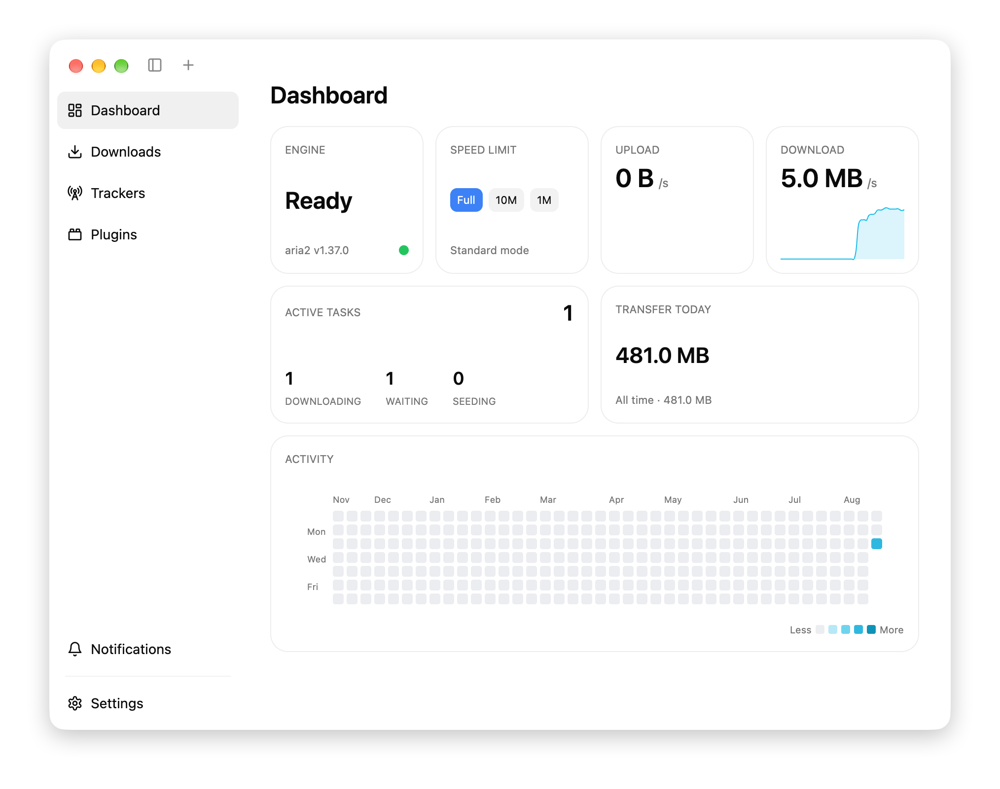
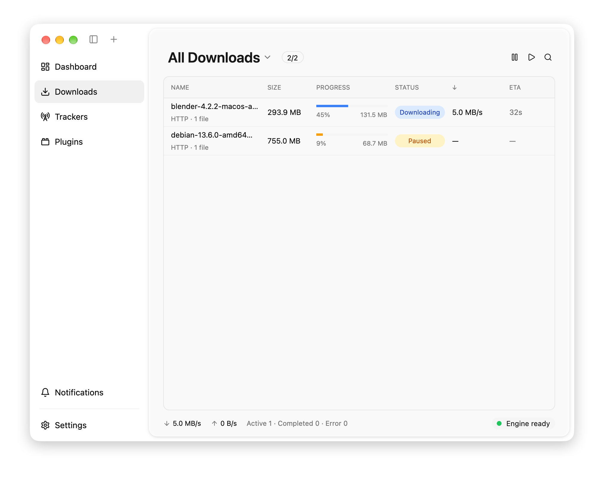
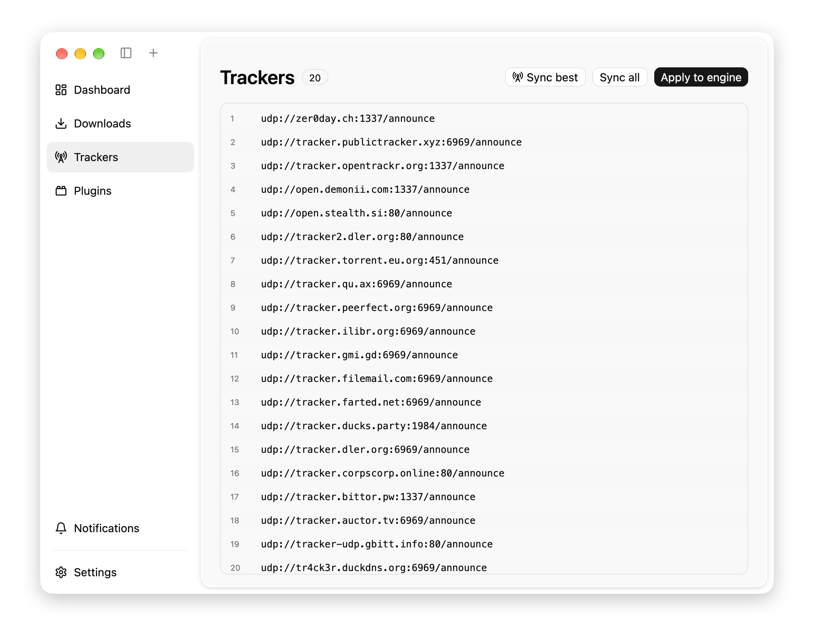
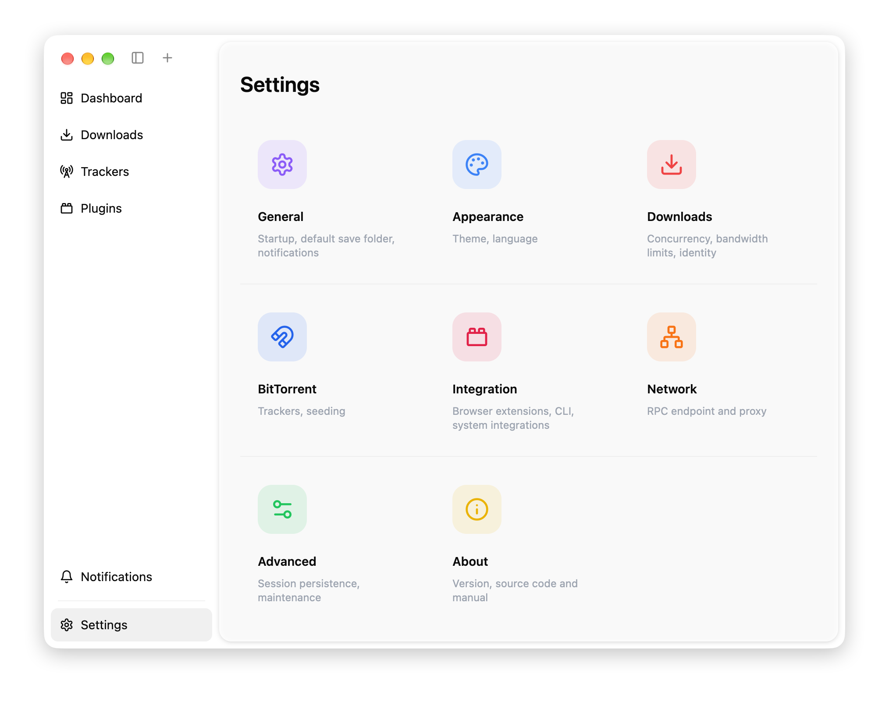

<div align="center">


# Motrix (GPUI)

A native rewrite of the [Motrix](https://github.com/agalwood/Motrix) download manager<br/>
in **Rust + [GPUI](https://github.com/zed-industries/zed)**, powered by **aria2**.

No Electron, no web view — a single native binary with a pixel-faithful take on Motrix's macOS design.

</div>

## Screenshots

| | |
|---|---|
|  |  |
|  |  |

## Features

- **Downloads**
  - HTTP / HTTPS / FTP / magnet links and `.torrent` files
  - aria2 engine managed as a child process (JSON-RPC over HTTP, 1s polling)
  - Multi-connection downloads, global concurrency and split limits
  - Pause / resume / restart per task, pause-all / resume-all
  - Remove with confirmation, optionally moving downloaded files to Trash
  - Session persistence — unfinished tasks survive restarts
  - Status filters (All / Downloading / Waiting / Completed / Stopped),
    search, multi-select with a bulk action bar, right-click context menus
- **Dashboard**
  - Engine status and version, one-click speed-limit presets
  - Live upload / download area charts (last 60 s)
  - Active-task and transfer-today counters
  - GitHub-style activity heatmap of daily download volume (stored locally)
- **BitTorrent**
  - Bundled community tracker list, one-click sync from
    ngosang/trackerslist (best / all) and apply-to-engine
  - DHT, PEX, seeding defaults
- **Notifications**
  - Task completed / failed events with an in-app notification feed
  - Native system notifications: UNUserNotificationCenter on macOS
    (permission prompt when running as a bundle), toasts on Windows,
    DBus on Linux
- **Settings**
  - Motrix-style card grid with detail pages: General, Appearance,
    Downloads, BitTorrent, Integration, Network, Advanced, About
  - Default save folder, notifications, resume-on-launch, quit warning
  - Bandwidth limits, connections per task, User-Agent
  - Light / dark / follow-system theme
- **macOS niceties**
  - Transparent title bar with inline traffic lights, blurred window
    background, drag regions that don't swallow button double-clicks
  - `⌘N` new task, `⌘B` toggle sidebar, `⌘Q` quit (with confirmation while
    downloads are running)

## Requirements

- Rust (2021 edition toolchain)
- [aria2](https://github.com/aria2/aria2): `brew install aria2`

## Run

```sh
cargo run
```

### macOS app bundle

System notifications (and the permission prompt) require a real `.app`:

```sh
./scripts/bundle-macos.sh          # debug build → target/Motrix.app
./scripts/bundle-macos.sh release  # release build
open target/Motrix.app
```

## Configuration

| File | Purpose |
|---|---|
| `~/Library/Application Support/motrix-gpui/config.json` | user preferences (theme, folders, limits, RPC port/secret) |
| `~/Library/Application Support/motrix-gpui/activity.json` | daily download volume for the dashboard heatmap |
| `~/Library/Application Support/motrix-gpui/aria2.session` | aria2 session (task resume) |

## Credits

This project stands on the shoulders of:

- [Motrix](https://github.com/agalwood/Motrix) — the original Electron app;
  this project mirrors its UI and feature set
- [aria2](https://github.com/aria2/aria2) — the download engine
- [GPUI](https://github.com/zed-industries/zed) — Zed's GPU-accelerated UI
  framework
- [gpui-component](https://github.com/longbridge/gpui-component) — UI
  component library for GPUI
- [Lucide Icons](https://github.com/lucide-icons/lucide) — icon set
- [ngosang/trackerslist](https://github.com/ngosang/trackerslist) — the
  bundled BitTorrent tracker list
- [notify-rust](https://github.com/hoodie/notify-rust) — Windows/Linux
  notifications
- [objc2](https://github.com/madsmtm/objc2) — macOS UserNotifications
  bindings

## License

MIT (the referenced projects keep their own licenses).
